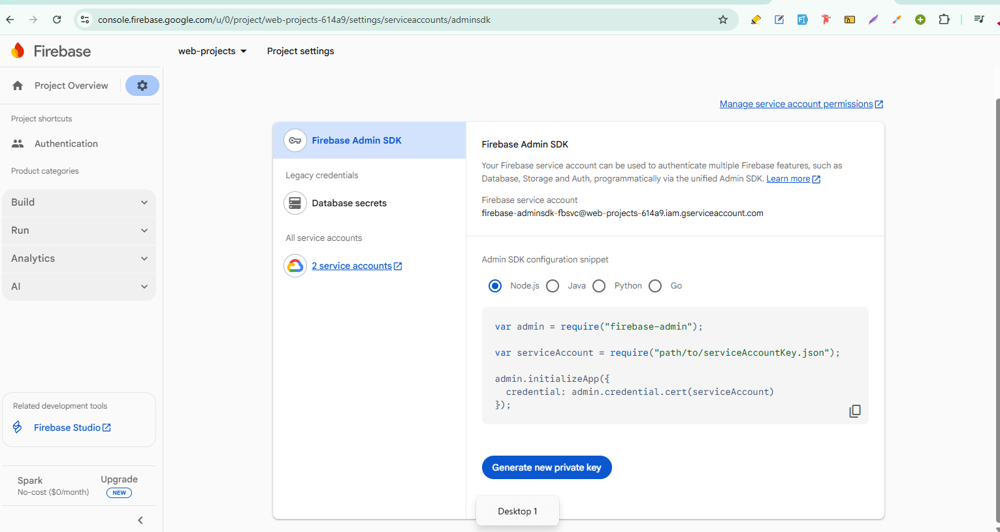

<h1 align="center">JWT Authorization Notes</h1>

- [Introduction:](#introduction)
- [setup:](#setup)
- [Different ways to implement JWT:](#different-ways-to-implement-jwt)
    - [JWT with LocalStorage:](#jwt-with-localstorage)
    - [JWT with Cookies:](#jwt-with-cookies)
    - [JWT with Firebase:](#jwt-with-firebase)


# Introduction: 
JWT stands for JSON Web Token. We used JWT for secure our api. 

# setup:

Install it to backend: 

```bash
npm i jsonwebtoken
``` 

# Different ways to implement JWT:

### JWT with LocalStorage: 

- Frontend:

```js
// AuthProvider.jsx
// import { auth } from '../firebase/firebase.init'
// import { AuthContext } from './AuthContext'
// import { useEffect, useState } from 'react'

// import {
//   createUserWithEmailAndPassword,
//   GoogleAuthProvider,
//   onAuthStateChanged,
//   signInWithEmailAndPassword,
//   signInWithPopup,
//   signOut,
//   updateProfile,
// } from 'firebase/auth'
// import axios from 'axios'

// const AuthProvider = ({ children }) => {
//   const googleProvider = new GoogleAuthProvider()

//   const [user, setUser] = useState(null)
//   const [loading, setLoading] = useState(true)


//   console.log(loading, user)

//   const createUser = (email, password) => {
//     setLoading(true)
//     return createUserWithEmailAndPassword(auth, email, password)
//   }

//   const signIn = (email, password) => {
//     setLoading(true)
//     return signInWithEmailAndPassword(auth, email, password)
//   }

//   const signInWithGoogle = () => {
//     setLoading(true)
//     return signInWithPopup(auth, googleProvider)
//   }

//   const updateUser = updatedData => {
//     return updateProfile(auth.currentUser, updatedData)
//   }

  const logOut = () => {
    localStorage.removeItem('token')
    return signOut(auth)
  }

  useEffect(() => {
    const unsubscribe = onAuthStateChanged(auth, currentUser => {
      setUser(currentUser)

      if (currentUser?.email) {
        axios.post(`${import.meta.env.VITE_API_URL}/jwt`, { email: currentUser?.email })
          .then(data => {
            console.log(data.data)
            localStorage.setItem('token', data.data.token)
          })
      }

      setLoading(false)
    })
    return () => {
      unsubscribe()
    }
  }, [])


//   const authData = {
//     user,
//     setUser,
//     createUser,
//     logOut,
//     signIn,
//     signInWithGoogle,
//     loading,
//     setLoading,
//     updateUser,
//   }
//   return <AuthContext value={authData}>{children}</AuthContext>
// }

// export default AuthProvider
```

```js
// MyOrders.jsx
// import axios from 'axios'
// import { use } from 'react'
// import { useEffect, useState } from 'react'
// import { AuthContext } from '../contexts/AuthContext'
// import OrderCard from './OrderCard'

// const MyOrders = () => {
//     const { user } = use(AuthContext)
//     const [orders, setOrders] = useState([])
    useEffect(() => {
        axios(`${import.meta.env.VITE_API_URL}/my-orders/${user?.email}`, {
            headers: {
                Authorization: `Bearer ${localStorage.getItem('token')}`
            }
        })
            .then(data => {
                console.log(data?.data)
                setOrders(data?.data)
            })
            .catch(err => {
                console.log(err)
            })
    }, [user])
//     return (
//         <div>
//             <div className='grid grid-cols-1 md:grid-cols-2 gap-6 py-12'>
//                 {/* Coffee Cards */}
//                 {orders.map(coffee => (
//                     <OrderCard key={coffee._id} coffee={coffee} />
//                 ))}
//             </div>
//         </div>
//     )
// }

// export default MyOrders
```

- Backend: 

```js
// index.js
// const express = require('express')
// const cors = require('cors') 
const jwt = require('jsonwebtoken') 
// require('dotenv').config()
// const { MongoClient, ServerApiVersion, ObjectId } = require('mongodb');

// const port = process.env.PORT || 3000

// const app = express()
// app.use(cors()) 
// app.use(express.json()) 


// const client = new MongoClient(process.env.MONGODB_URI, {
//     serverApi: {
//         version: ServerApiVersion.v1,
//         strict: true,
//         deprecationErrors: true,
//     }
// });


// -------------JWT with local storage middle ware---------
const verifyJwt = (req, res, next) => {
    const token = req?.headers?.authorization?.split(' ')[1]
    if (!token) return res.status(401).send({ message: "Unauthorized assess" })

    jwt.verify(token, process.env.JWT_SECRET_KEY, (err, decoded) => {
        if (err) {
            return res.status(401).send({ message: "Unauthorized assess" })
        }
        req.tokenEmail = decoded.email
        next()
    })
}

async function run() {
    // await client.connect();

    // const coffeesCollection = client.db("coffeesDB").collection('coffees')
    // const ordersCollection = client.db("coffeesDB").collection('orders')


    app.post("/jwt", async (req, res) => {
        const email = req.body.email
        const token = jwt.sign({ email }, process.env.JWT_SECRET_KEY, { expiresIn: '7d' })
        res.send({ token })
    })


    app.get('/my-orders/:email', verifyJwt, async (req, res) => {

        const decodedEmail = req.tokenEmail
        const email = req.params.email

        if (decodedEmail !== email) {
            return res.status(403).send({ message: "Forbidden assess" })
        }

        // const filter = { customerEmail: email }
        // const allOrders = await ordersCollection.find(filter).toArray()

        // for (const order of allOrders) {
        //     const orderId = order.coffeeId
        //     const filter = { _id: new ObjectId(orderId) }
        //     const fullCoffeeData = await coffeesCollection.findOne(filter)
        //     order.name = fullCoffeeData.name
        //     order.photo = fullCoffeeData.photo
        //     order.price = fullCoffeeData.price
        //     order.quantity = fullCoffeeData.quantity
        // }

        // res.send(allOrders)
    })

    // Send a ping to confirm a successful connection
//     await client.db("admin").command({ ping: 1 });
//     console.log("Pinged your deployment. You successfully connected to MongoDB!");
}
run().catch(console.dir);


// app.get('/', (req, res) => {
//     res.send('Hello World!')
// })

// app.listen(port, () => {
//     console.log(`Example app listening on port ${port}`)
// })
```

```js
// env
MONGODB_URI = 
PORT = 
JWT_SECRET_KEY = require('crypto').randomBytes(64).toString('hex')
```

### JWT with Cookies: 

- Frontend:

```js
// AuthProvider.jsx
// import { auth } from '../firebase/firebase.init'
// import { AuthContext } from './AuthContext'
// import { useEffect, useState } from 'react'

// import {
//   createUserWithEmailAndPassword,
//   GoogleAuthProvider,
//   onAuthStateChanged,
//   signInWithEmailAndPassword,
//   signInWithPopup,
//   signOut,
//   updateProfile,
// } from 'firebase/auth'
// import axios from 'axios'

// const AuthProvider = ({ children }) => {
//   const googleProvider = new GoogleAuthProvider()

//   const [user, setUser] = useState(null)
//   const [loading, setLoading] = useState(true)


//   console.log(loading, user)

//   const createUser = (email, password) => {
//     setLoading(true)
//     return createUserWithEmailAndPassword(auth, email, password)
//   }

//   const signIn = (email, password) => {
//     setLoading(true)
//     return signInWithEmailAndPassword(auth, email, password)
//   }

//   const signInWithGoogle = () => {
//     setLoading(true)
//     return signInWithPopup(auth, googleProvider)
//   }

//   const updateUser = updatedData => {
//     return updateProfile(auth.currentUser, updatedData)
//   }

//   const logOut = () => {
//     return signOut(auth)
//   }

  useEffect(() => {
    const unsubscribe = onAuthStateChanged(auth, currentUser => {
      setUser(currentUser)

      if (currentUser?.email) {
        axios.post(`${import.meta.env.VITE_API_URL}/jwt`, { email: currentUser?.email }, { withCredentials: true })
          .then(data => {
            console.log(data.data)
          })
      }

      setLoading(false)
    })
    return () => {
      unsubscribe()
    }
  }, [])


//   const authData = {
//     user,
//     setUser,
//     createUser,
//     logOut,
//     signIn,
//     signInWithGoogle,
//     loading,
//     setLoading,
//     updateUser,
//   }
//   return <AuthContext value={authData}>{children}</AuthContext>
// }

// export default AuthProvider
```

```js
// MyOrders.jsx
// import axios from 'axios'
// import { use } from 'react'
// import { useEffect, useState } from 'react'
// import { AuthContext } from '../contexts/AuthContext'
// import OrderCard from './OrderCard'

// const MyOrders = () => {
//     const { user } = use(AuthContext)
//     const [orders, setOrders] = useState([])
    useEffect(() => {
        axios(`${import.meta.env.VITE_API_URL}/my-orders/${user?.email}`, { withCredentials: true })
            .then(data => {
                console.log(data?.data)
                setOrders(data?.data)
            })
            .catch(err => {
                console.log(err)
            })
    }, [user])
//     return (
//         <div>
//             <div className='grid grid-cols-1 md:grid-cols-2 gap-6 py-12'>
//                 {/* Coffee Cards */}
//                 {orders.map(coffee => (
//                     <OrderCard key={coffee._id} coffee={coffee} />
//                 ))}
//             </div>
//         </div>
//     )
// }

// export default MyOrders
```


- Backend:

```
npm i cookie-parser
```

```js
// index.js
// const express = require('express')
// const cors = require('cors') 
const jwt = require('jsonwebtoken') 
const cookieParser = require('cookie-parser')
// require('dotenv').config()
// const { MongoClient, ServerApiVersion, ObjectId } = require('mongodb');

// const port = process.env.PORT || 3000

// const app = express()
app.use(cors({
    origin: ['http://localhost:5173', 'add others frontend urls'],
    credentials: true
}))
// app.use(express.json()) 


// const client = new MongoClient(process.env.MONGODB_URI, {
//     serverApi: {
//         version: ServerApiVersion.v1,
//         strict: true,
//         deprecationErrors: true,
//     }
// });


// -------------JWT with local storage middle ware---------
const verifyJwt = (req, res, next) => {
    // const token = req?.headers?.authorization?.split(' ')[1]
    const token = req?.cookies?.token
    if (!token) return res.status(401).send({ message: "Unauthorized assess" })

    jwt.verify(token, process.env.JWT_SECRET_KEY, (err, decoded) => {
        if (err) {
            return res.status(401).send({ message: "Unauthorized assess" })
        }
        req.tokenEmail = decoded.email
        next()
    })
}

async function run() {
    // await client.connect();

    // const coffeesCollection = client.db("coffeesDB").collection('coffees')
    // const ordersCollection = client.db("coffeesDB").collection('orders')


    app.post("/jwt", async (req, res) => {
        const email = req.body.email
        const token = jwt.sign({ email }, process.env.JWT_SECRET_KEY, { expiresIn: '7d' })

        res.cookie('token', token, { httpOnly: true, secure: false }).send({ message: "JWT with cookie created" })
    })


    app.get('/my-orders/:email', verifyJwt, async (req, res) => {

        const decodedEmail = req.tokenEmail
        const email = req.params.email

        if (decodedEmail !== email) {
            return res.status(403).send({ message: "Forbidden assess" })
        }

        // const filter = { customerEmail: email }
        // const allOrders = await ordersCollection.find(filter).toArray()

        // for (const order of allOrders) {
        //     const orderId = order.coffeeId
        //     const filter = { _id: new ObjectId(orderId) }
        //     const fullCoffeeData = await coffeesCollection.findOne(filter)
        //     order.name = fullCoffeeData.name
        //     order.photo = fullCoffeeData.photo
        //     order.price = fullCoffeeData.price
        //     order.quantity = fullCoffeeData.quantity
        // }

        // res.send(allOrders)
    })

    // Send a ping to confirm a successful connection
//     await client.db("admin").command({ ping: 1 });
//     console.log("Pinged your deployment. You successfully connected to MongoDB!");
}
run().catch(console.dir);


// app.get('/', (req, res) => {
//     res.send('Hello World!')
// })

// app.listen(port, () => {
//     console.log(`Example app listening on port ${port}`)
// })
```

### JWT with Firebase:

- Frontend: 

```js
// AuthProvider.jsx
// import { auth } from '../firebase/firebase.init'
// import { AuthContext } from './AuthContext'
// import { useEffect, useState } from 'react'

// import {
//   createUserWithEmailAndPassword,
//   GoogleAuthProvider,
//   onAuthStateChanged,
//   signInWithEmailAndPassword,
//   signInWithPopup,
//   signOut,
//   updateProfile,
// } from 'firebase/auth'
// import axios from 'axios'

// const AuthProvider = ({ children }) => {
//   const googleProvider = new GoogleAuthProvider()

//   const [user, setUser] = useState(null)
//   const [loading, setLoading] = useState(true)


//   console.log(loading, user)

//   const createUser = (email, password) => {
//     setLoading(true)
//     return createUserWithEmailAndPassword(auth, email, password)
//   }

//   const signIn = (email, password) => {
//     setLoading(true)
//     return signInWithEmailAndPassword(auth, email, password)
//   }

//   const signInWithGoogle = () => {
//     setLoading(true)
//     return signInWithPopup(auth, googleProvider)
//   }

//   const updateUser = updatedData => {
//     return updateProfile(auth.currentUser, updatedData)
//   }

//   const logOut = () => {
//     localStorage.removeItem('token')
//     return signOut(auth)
//   }

  useEffect(() => {
    const unsubscribe = onAuthStateChanged(auth, currentUser => {
      setUser(currentUser)

      if (currentUser?.email) {
        axios.post(`${import.meta.env.VITE_API_URL}/jwt`, { email: currentUser?.email })
          .then(data => {
            console.log(data.data)
          })
      }

      setLoading(false)
    })
    return () => {
      unsubscribe()
    }
  }, [])

//   const authData = {
//     user,
//     setUser,
//     createUser,
//     logOut,
//     signIn,
//     signInWithGoogle,
//     loading,
//     setLoading,
//     updateUser,
//   }
//   return <AuthContext value={authData}>{children}</AuthContext>
// }

// export default AuthProvider
```

```js
// import axios from 'axios'
// import { use } from 'react'
// import { useEffect, useState } from 'react'
// import { AuthContext } from '../contexts/AuthContext'
// import OrderCard from './OrderCard'

// const MyOrders = () => {
    const { user } = use(AuthContext)
    const [orders, setOrders] = useState([])

    const token = user?.accessToken
    useEffect(() => {
        axios(`${import.meta.env.VITE_API_URL}/my-orders/${user?.email}`, {
            headers: {
                Authorization: `Bearer ${token}`
            }
        })
            .then(data => {
                console.log(data?.data)
                setOrders(data?.data)
            })
            .catch(err => {
                console.log(err)
            })
    }, [user, token])
//     return (
//         <div>
//             <div className='grid grid-cols-1 md:grid-cols-2 gap-6 py-12'>
//                 {/* Coffee Cards */}
//                 {orders.map(coffee => (
//                     <OrderCard key={coffee._id} coffee={coffee} />
//                 ))}
//             </div>
//         </div>
//     )
// }

// export default MyOrders
```

- Backend: 

Step 1: 

```js
npm i firebase-admin
```

Step 2: Go to firebase console: (Project Overview --> General --> Service Accounts) and generate private key



step 3: Convert the private key to base64 and store it into the env:

```js
MONGODB_URI = .....................
PORT = 3000
JWT_SECRET_KEY = ............
# require('crypto').randomBytes(64).toString('hex')

FB_SERVICE_KEY=...................................................................

# const fs = require('fs')
# const jsonData = fs.readFileSync('./serviceAccountKey.json')

# const base64String = Buffer.from(jsonData, 'utf-8').toString('base64')
# console.log(base64String)
```


step 4: 

```js
// const express = require('express')
// const cors = require('cors')
// const jwt = require('jsonwebtoken')
const admin = require("firebase-admin");
const { getAuth } = require("firebase-admin/auth") // if you use admin.auth() then not need this, but its recommended
// require('dotenv').config()

// const { MongoClient, ServerApiVersion, ObjectId } = require('mongodb');

const decoded = Buffer.from(process.env.FB_SERVICE_KEY, 'base64').toString('utf-8')
const serviceAccount = JSON.parse(decoded);
admin.initializeApp({
    credential: admin.credential.cert(serviceAccount)
});

// const port = process.env.PORT || 3000

// const app = express()
// app.use(cors())
// app.use(express.json())

// const client = new MongoClient(process.env.MONGODB_URI, {
//     serverApi: {
//         version: ServerApiVersion.v1,
//         strict: true,
//         deprecationErrors: true,
//     }
// });

// jwt middleware
const verifyJwt = async (req, res, next) => {
    const token = req?.headers?.authorization?.split(' ')[1]

    if (!token) return res.status(401).send({ message: 'Unauthorized Access!' })

    try {
        const decoded = await getAuth().verifyIdToken(token)
        // const decoded = await admin.auth().verifyIdToken(token)
        console.log(decoded)
        req.tokenEmail = decoded.email
        next()
    }
    catch (err) {
        return res.status(401).send({ message: 'Unauthorized Access!' })
    }

}

async function run() {
    // await client.connect();

    // const coffeesCollection = client.db("coffeesDB").collection('coffees')
    // const ordersCollection = client.db("coffeesDB").collection('orders')

    // jwt to cookie 
    app.post("/jwt", async (req, res) => {
        const email = req.body.email
        const token = jwt.sign({ email }, process.env.JWT_SECRET_KEY, { expiresIn: '7d' })

        res.cookie('token', token, { httpOnly: true, secure: false }).send({ message: "JWT with cookie created" })
    })

    // get all orders by customer email
    app.get('/my-orders/:email', verifyJwt, async (req, res) => {

        const decodedEmail = req.tokenEmail
        const email = req.params.email

        if (decodedEmail !== email) {
            return res.status(403).send({ message: "Forbidden assess" })
        }

        // const filter = { customerEmail: email }
        // const allOrders = await ordersCollection.find(filter).toArray()

        // for (const order of allOrders) {
        //     const orderId = order.coffeeId
        //     const filter = { _id: new ObjectId(orderId) }
        //     const fullCoffeeData = await coffeesCollection.findOne(filter)
        //     order.name = fullCoffeeData.name
        //     order.photo = fullCoffeeData.photo
        //     order.price = fullCoffeeData.price
        //     order.quantity = fullCoffeeData.quantity
        // }

        res.send(allOrders)
    })

    // Send a ping to confirm a successful connection
    await client.db("admin").command({ ping: 1 });
    console.log("Pinged your deployment. You successfully connected to MongoDB!");
}
run().catch(console.dir);


// app.get('/', (req, res) => {
//     res.send('Hello World!')
// })

// app.listen(port, () => {
//     console.log(`Example app listening on port ${port}`)
// })
```