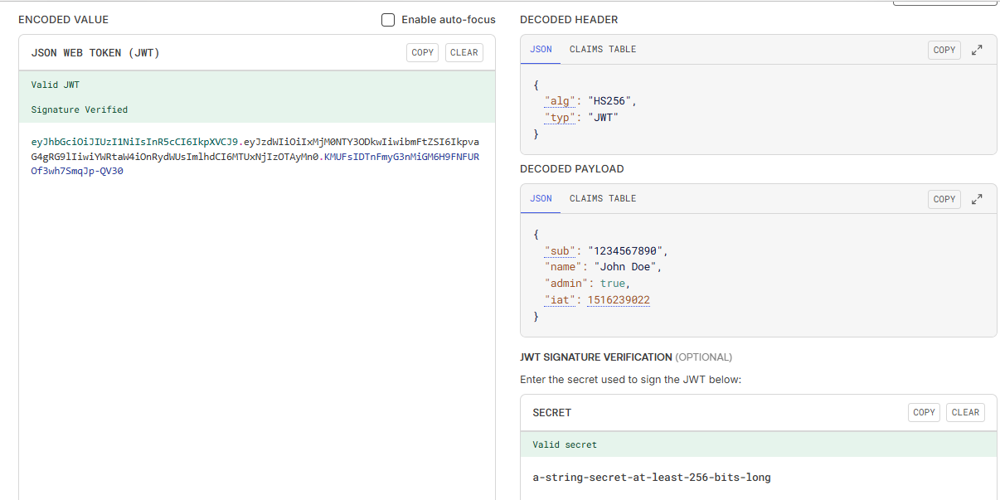

<h1 align="center">JWT Authorization Notes</h1>

- [Introduction:](#introduction)
    - [JWT structure:](#jwt-structure)
- [Authorization using JWT:](#authorization-using-jwt)
    - [JWT with LocalStorage:](#jwt-with-localstorage)
    - [JWT with Cookies:](#jwt-with-cookies)
      - [Without axios interceptor:](#without-axios-interceptor)
      - [With axios interceptor:](#with-axios-interceptor)
- [Authorization using firebase:](#authorization-using-firebase)


# Introduction: 
JWT stands for JSON Web Token. We use JWT to secure our API. It is a compact and secure way to transmit information between a client and a server as a JSON object.

After a user logs in successfully, the server generates a JWT and sends it to the client. The client then includes this token with every request to access protected routes (usually in the Authorization header).

The server verifies the token before allowing access to protected data. Without a valid token, a hacker or unauthorized user cannot access the API. Therefore, to access protected data, users must first log in through our system.

### JWT structure:

A JWT consists of three parts, separated by dots (.): header.payload.signature



# Authorization using JWT:

### JWT with LocalStorage: 

- Frontend:

```js
// AuthProvider.jsx
import { auth } from '../firebase/firebase.init'
import { AuthContext } from './AuthContext'
import { useEffect, useState } from 'react'
import { GoogleAuthProvider, onAuthStateChanged, signInWithPopup, signOut, } from 'firebase/auth'
import axios from 'axios'

const AuthProvider = ({ children }) => {
  const googleProvider = new GoogleAuthProvider()

  const [user, setUser] = useState(null)
  const [loading, setLoading] = useState(true)

  const signInWithGoogle = () => {
    setLoading(true)
    return signInWithPopup(auth, googleProvider)
  }

  const logOut = () => {
    localStorage.removeItem('token')
    return signOut(auth)
  }

  useEffect(() => {
    const unsubscribe = onAuthStateChanged(auth, currentUser => {
      setUser(currentUser)

      if (currentUser?.email) {
        axios.post(`${import.meta.env.VITE_API_URL}/jwt`, { email: currentUser?.email })
          .then(data => {
            console.log(data.data)
            localStorage.setItem('token', data.data.token)
          })
      }

      setLoading(false)

    })
    return () => {
      unsubscribe()
    }
  }, [])

  const authData = {
    user,
    setUser,
    logOut,
    signInWithGoogle,
    loading,
    setLoading,
  }
  return <AuthContext value={authData}>{children}</AuthContext>
}

export default AuthProvider
```

```js
// MyRecipes.jsx
import React, { useContext, useEffect, useState } from 'react';
import axios from 'axios';
import { AuthContext } from '../contexts/AuthContext';

const MyRecipes = () => {
    const { user } = useContext(AuthContext)

    const [recipes, setRecipes] = useState([])

    useEffect(() => {

        axios.get(`${import.meta.env.VITE_API_URL}/recipes/${user.email}`, {
            headers: {
                Authorization: `Bearer ${localStorage.getItem('token')}`
            }
        })
            .then(data => setRecipes(data?.data))
            .catch(err => console.log(err))

    }, [user])

    return (
        <div className='grid grid-cols-5 gap-5'>
            {recipes.map(recipe => <div key={recipe._id} className='border'>
                
                <p>{recipe.title}</p>
            </div>
            )}
        </div>
    );
};

export default MyRecipes;
```

- Backend: 

```bash
npm i jsonwebtoken
```

```js
const express = require('express')
const cors = require('cors')
require('dotenv').config()
const { MongoClient, ServerApiVersion, ObjectId } = require('mongodb');
const jwt = require('jsonwebtoken')

const port = process.env.PORT || 3000

const app = express()
app.use(cors())
app.use(express.json())

const client = new MongoClient(process.env.MONGODB_URI, {
    serverApi: {
        version: ServerApiVersion.v1,
        strict: true,
        deprecationErrors: true,
    }
});

// JWT Middleware
const verifyJwt = (req, res, next) => {
    const token = req?.headers?.authorization?.split(' ')[1]
    if (!token) return res.status(401).send({ message: "Unauthorized assess" })

    jwt.verify(token, process.env.JWT_SECRET_KEY, (err, decoded) => {
        if (err) {
            return res.status(401).send({ message: "Unauthorized assess" })
        }
        req.user = decoded;
        next()
    })
}

async function run() {

    await client.connect();

    const recipesCollection = client.db("recipesDB").collection('recipes')

    app.post("/jwt", async (req, res) => {
        const email = req.body.email
        const token = jwt.sign({ email }, process.env.JWT_SECRET_KEY, { expiresIn: '7d' })
        res.send({ token })
    })

    app.get('/recipes', async (req, res) => {
        const result = await recipesCollection.find({}).toArray();
        res.send(result);
    });

    app.get('/recipes/:email', verifyJwt, async (req, res) => {
        const email = req.params.email

        if (req.user.email !== email) return res.status(403).send({ message: "Forbidden access" });

        const filter = { email }
        const result = await recipesCollection.find(filter).toArray();
        res.send(result);
    });

    await client.db("admin").command({ ping: 1 });
    console.log("Pinged your deployment. You successfully connected to MongoDB!");
}
run().catch(console.dir);


app.get('/', (req, res) => {
    res.send('Hello World!')
})

app.listen(port, () => {
    console.log(`Example app listening on port ${port}`)
})
```

```js
// env
MONGODB_URI = .......... 
PORT = ......
JWT_SECRET_KEY = ..................
require('crypto').randomBytes(64).toString('hex')
```

### JWT with Cookies: 

#### Without axios interceptor: 

- Frontend:

```js
// AuthProvider.jsx
import { auth } from '../firebase/firebase.init'
import { AuthContext } from './AuthContext'
import { useEffect, useState } from 'react'
import { GoogleAuthProvider, onAuthStateChanged, signInWithPopup, signOut, } from 'firebase/auth'
import axios from 'axios'

const AuthProvider = ({ children }) => {
  const googleProvider = new GoogleAuthProvider()

  const [user, setUser] = useState(null)
  const [loading, setLoading] = useState(true)

  const signInWithGoogle = () => {
    setLoading(true)
    return signInWithPopup(auth, googleProvider)
  }

  const logOut = () => {
    return axios.post(`${import.meta.env.VITE_API_URL}/jwt-logout`, {}, { withCredentials: true })
      .then(() => signOut(auth))
  }

  useEffect(() => {
    const unsubscribe = onAuthStateChanged(auth, currentUser => {
      setUser(currentUser)

      if (currentUser?.email) {
        axios.post(`${import.meta.env.VITE_API_URL}/jwt`,
          { email: currentUser?.email },
          { withCredentials: true }
        )
          .then(data => {
            console.log(data.data)
          })
      }

      setLoading(false)

    })
    return () => {
      unsubscribe()
    }
  }, [])

  const authData = {
    user,
    setUser,
    logOut,
    signInWithGoogle,
    loading,
    setLoading,
  }
  return <AuthContext value={authData}>{children}</AuthContext>
}

export default AuthProvider
```

```js
// MyRecipes.jsx
import React, { useContext, useEffect, useState } from 'react';
import axios from 'axios';
import { AuthContext } from '../contexts/AuthContext';

const MyRecipes = () => {
    const { user } = useContext(AuthContext)

    const [recipes, setRecipes] = useState([])

    useEffect(() => {

        axios.get(`${import.meta.env.VITE_API_URL}/recipes/${user.email}`, { withCredentials: true })
            .then(data => setRecipes(data?.data))
            .catch(err => console.log(err))

    }, [user])

    return (
        <div className='grid grid-cols-5 gap-5'>
            {recipes.map(recipe => <div key={recipe._id} className='border'>
                
                <p>{recipe.title}</p>
            </div>
            )}
        </div>
    );
};

export default MyRecipes;
```


- Backend:

```
npm i cookie-parser
```

```js
const express = require('express')
const cors = require('cors')
require('dotenv').config()
const { MongoClient, ServerApiVersion, ObjectId } = require('mongodb');
const jwt = require('jsonwebtoken')
const cookieParser = require('cookie-parser')


const port = process.env.PORT || 3000

const app = express()
app.use(cors({
    origin: ['http://localhost:5173', 'add others frontend urls'],
    credentials: true
}))
app.use(express.json())
app.use(cookieParser())

const client = new MongoClient(process.env.MONGODB_URI, {
    serverApi: {
        version: ServerApiVersion.v1,
        strict: true,
        deprecationErrors: true,
    }
});

// JWT Middleware
const verifyToken = (req, res, next) => {
    const token = req?.cookies?.token
    if (!token) return res.status(401).send({ message: "Not authenticated" })

    jwt.verify(token, process.env.JWT_SECRET_KEY, (err, decoded) => {
        if (err) {
            return res.status(401).send({ message: "Token expired or invalid" })
        }
        req.decoded = decoded;
        next()
    })
}

async function run() {

    await client.connect();

    const recipesCollection = client.db("recipesDB").collection('recipes')

    app.post("/jwt", async (req, res) => {
        const email = req.body.email
        const token = jwt.sign({ email }, process.env.JWT_SECRET_KEY, { expiresIn: '7d' })

        res.cookie('token', token, { httpOnly: true, secure: false })
            .send({ message: "JWT with cookie created" })
    })

    app.post('/jwt-logout', (req, res) => {
        res.clearCookie('token', { httpOnly: true, secure: false })
            .send({ message: 'JWT with cookie Logged out successfully' })
    })


    app.get('/recipes', async (req, res) => {
        const result = await recipesCollection.find({}).toArray();
        res.send(result);
    });

    app.get('/recipes/:email', verifyToken, async (req, res) => {
        const email = req.params.email

        if (req.decoded.email !== email) return res.status(403).send({ message: "Forbidden access" });

        const filter = { email }
        const result = await recipesCollection.find(filter).toArray();
        res.send(result);
    });

    await client.db("admin").command({ ping: 1 });
    console.log("Pinged your deployment. You successfully connected to MongoDB!");
}
run().catch(console.dir);


app.get('/', (req, res) => {
    res.send('Hello World!')
})

app.listen(port, () => {
    console.log(`Example app listening on port ${port}`)
})
```

```js
// env
MONGODB_URI = .......... 
PORT = ......
JWT_SECRET_KEY = ..................
require('crypto').randomBytes(64).toString('hex')
```

#### With axios interceptor: 


- Frontend:

```js
// AuthProvider.jsx
import { auth } from '../firebase/firebase.init'
import { AuthContext } from './AuthContext'
import { useEffect, useState } from 'react'
import { GoogleAuthProvider, onAuthStateChanged, signInWithPopup, signOut, } from 'firebase/auth'
import axios from 'axios'

const AuthProvider = ({ children }) => {
  const googleProvider = new GoogleAuthProvider()

  const [user, setUser] = useState(null)
  const [loading, setLoading] = useState(true)

  const signInWithGoogle = () => {
    setLoading(true)
    return signInWithPopup(auth, googleProvider)
  }

  const logOut = () => {
    return axios.post(`${import.meta.env.VITE_API_URL}/jwt-logout`, {}, { withCredentials: true })
      .then(() => signOut(auth))
  }

  useEffect(() => {
    const unsubscribe = onAuthStateChanged(auth, currentUser => {
      setUser(currentUser)

      if (currentUser?.email) {
        axios.post(`${import.meta.env.VITE_API_URL}/jwt`,
          { email: currentUser?.email },
          { withCredentials: true }
        )
          .then(data => {
            console.log(data.data)
          })
      }

      setLoading(false)

    })
    return () => {
      unsubscribe()
    }
  }, [])

  const authData = {
    user,
    setUser,
    logOut,
    signInWithGoogle,
    loading,
    setLoading,
  }
  return <AuthContext value={authData}>{children}</AuthContext>
}

export default AuthProvider
```

```js
// api/axiosSecure.js
import axios from 'axios'
import { signOut } from 'firebase/auth'
import { auth } from '../firebase/firebase.init'

const axiosSecure = axios.create({
    baseURL: import.meta.env.VITE_API_URL,
    withCredentials: true
})

axiosSecure.interceptors.response.use(
    response => response,
    error => {
        if (error.response?.status === 401 || error.response?.status === 403) {
            signOut(auth)
            window.location.href = '/signin'
        }
        return Promise.reject(error)
    }
)

export default axiosSecure
```

```js
// MyRecipes.jsx
import React, { useContext, useEffect, useState } from 'react';
import { AuthContext } from '../contexts/AuthContext';
import axiosSecure from '../api/axiosSecure';

const MyRecipes = () => {
    const { user } = useContext(AuthContext)

    const [recipes, setRecipes] = useState([])

    useEffect(() => {

        axiosSecure.get(`/recipes/${user.email}`)
            .then(data => setRecipes(data?.data))
            .catch(err => console.log(err))

    }, [user])

    return (
        <div className='grid grid-cols-5 gap-5'>
            {recipes.map(recipe => <div key={recipe._id} className='border'>
                
                <p>{recipe.title}</p>
            </div>
            )}
        </div>
    );
};

export default MyRecipes;
```


- Backend:

```
npm i cookie-parser
```

```js
const express = require('express')
const cors = require('cors')
require('dotenv').config()
const { MongoClient, ServerApiVersion, ObjectId } = require('mongodb');
const jwt = require('jsonwebtoken')
const cookieParser = require('cookie-parser')


const port = process.env.PORT || 3000

const app = express()
app.use(cors({
    origin: ['http://localhost:5173', 'add others frontend urls'],
    credentials: true
}))
app.use(express.json())
app.use(cookieParser())

const client = new MongoClient(process.env.MONGODB_URI, {
    serverApi: {
        version: ServerApiVersion.v1,
        strict: true,
        deprecationErrors: true,
    }
});

// JWT Middleware
const verifyToken = (req, res, next) => {
    const token = req?.cookies?.token
    if (!token) return res.status(401).send({ message: "Not authenticated" })

    jwt.verify(token, process.env.JWT_SECRET_KEY, (err, decoded) => {
        if (err) {
            return res.status(401).send({ message: "Token expired or invalid" })
        }
        req.decoded = decoded;
        next()
    })
}

async function run() {

    await client.connect();

    const recipesCollection = client.db("recipesDB").collection('recipes')

    app.post("/jwt", async (req, res) => {
        const email = req.body.email
        const token = jwt.sign({ email }, process.env.JWT_SECRET_KEY, { expiresIn: '7d' })

        res.cookie('token', token, { httpOnly: true, secure: false })
            .send({ message: "JWT with cookie created" })
    })

    app.post('/jwt-logout', (req, res) => {
        res.clearCookie('token', { httpOnly: true, secure: false })
            .send({ message: 'JWT with cookie Logged out successfully' })
    })


    app.get('/recipes', async (req, res) => {
        const result = await recipesCollection.find({}).toArray();
        res.send(result);
    });

    app.get('/recipes/:email', verifyToken, async (req, res) => {
        const email = req.params.email

        if (req.decoded.email !== email) return res.status(403).send({ message: "Forbidden access" });

        const filter = { email }
        const result = await recipesCollection.find(filter).toArray();
        res.send(result);
    });

    await client.db("admin").command({ ping: 1 });
    console.log("Pinged your deployment. You successfully connected to MongoDB!");
}
run().catch(console.dir);


app.get('/', (req, res) => {
    res.send('Hello World!')
})

app.listen(port, () => {
    console.log(`Example app listening on port ${port}`)
})
```

```js
MONGODB_URI = .......... 
PORT = ......
JWT_SECRET_KEY = ..................
require('crypto').randomBytes(64).toString('hex')
```

# Authorization using firebase:

- Frontend: 

```js
// AuthProvider.jsx
import { auth } from '../firebase/firebase.init'
import { AuthContext } from './AuthContext'
import { useEffect, useState } from 'react'
import { GoogleAuthProvider, onAuthStateChanged, signInWithPopup, signOut, } from 'firebase/auth'

const AuthProvider = ({ children }) => {
  const googleProvider = new GoogleAuthProvider()

  const [user, setUser] = useState(null)
  const [loading, setLoading] = useState(true)

  const signInWithGoogle = () => {
    setLoading(true)
    return signInWithPopup(auth, googleProvider)
  }

  const logOut = () => {
    return signOut(auth)
  }

  useEffect(() => {
    const unsubscribe = onAuthStateChanged(auth, currentUser => {
      setUser(currentUser)
      setLoading(false)

    })
    return () => {
      unsubscribe()
    }
  }, [])

  const authData = {
    user,
    setUser,
    logOut,
    signInWithGoogle,
    loading,
    setLoading,
  }
  return <AuthContext value={authData}>{children}</AuthContext>
}

export default AuthProvider
```

```js
// MyRecipes.jsx
import React, { useContext, useEffect, useState } from 'react';
import axios from 'axios';
import { AuthContext } from '../contexts/AuthContext';

const MyRecipes = () => {
    const { user } = useContext(AuthContext)

    const [recipes, setRecipes] = useState([])

    useEffect(() => {

        axios.get(`${import.meta.env.VITE_API_URL}/recipes/${user.email}`, {
            headers: {
                Authorization: `Bearer ${user?.accessToken}`
            }
        })
            .then(data => setRecipes(data?.data))
            .catch(err => console.log(err))

    }, [user])

    return (
        <div className='grid grid-cols-5 gap-5'>
            {recipes.map(recipe => <div key={recipe._id} className='border'>
                
                <p>{recipe.title}</p>
            </div>
            )}
        </div>
    );
};

export default MyRecipes;
```

- Backend: 

Step 1: 

```bash
npm i firebase-admin
```

Step 2: Go to firebase console: (Project Overview --> General --> Service Accounts) and generate private key


step 3: Convert the private key to base64 and store it into the env:

```js
MONGODB_URI = .....................
PORT = 3000
FB_SERVICE_KEY=...................................................................

# const fs = require('fs')
# const jsonData = fs.readFileSync('./serviceAccountKey.json')

# const base64String = Buffer.from(jsonData, 'utf-8').toString('base64')
# console.log(base64String)
```


step 4: 

```js
// index.js
const express = require('express')
const cors = require('cors')
require('dotenv').config()
const { MongoClient, ServerApiVersion, ObjectId } = require('mongodb');
const admin = require("firebase-admin");


const decoded = Buffer.from(process.env.FB_SERVICE_KEY, 'base64').toString('utf-8')
const serviceAccount = JSON.parse(decoded);
admin.initializeApp({
    credential: admin.credential.cert(serviceAccount)
});

const port = process.env.PORT || 3000

const app = express()
app.use(cors())
app.use(express.json())

const client = new MongoClient(process.env.MONGODB_URI, {
    serverApi: {
        version: ServerApiVersion.v1,
        strict: true,
        deprecationErrors: true,
    }
});

// firebase Middleware
const verifyToken = async (req, res, next) => {
    const token = req?.headers?.authorization?.split(' ')[1]
    if (!token) return res.status(401).send({ message: "Not authenticated" })

    try {
        const decoded = await admin.auth().verifyIdToken(token)
        // const decoded = await getAuth().verifyIdToken(token) // if use use const { getAuth } = require("firebase-admin/auth")
        req.decoded = decoded;
        next()
    }
    catch (err) {
        return res.status(401).send({ message: "Token expired or invalid" })
    }
}

async function run() {

    await client.connect();

    const recipesCollection = client.db("recipesDB").collection('recipes')

    app.get('/recipes', async (req, res) => {
        const result = await recipesCollection.find({}).toArray();
        res.send(result);
    });

    app.get('/recipes/:email', verifyToken, async (req, res) => {
        const email = req.params.email

        if (req.decoded.email !== email) return res.status(403).send({ message: "Forbidden access" });

        const filter = { email }
        const result = await recipesCollection.find(filter).toArray();
        res.send(result);
    });

    await client.db("admin").command({ ping: 1 });
    console.log("Pinged your deployment. You successfully connected to MongoDB!");
}
run().catch(console.dir);


app.get('/', (req, res) => {
    res.send('Hello World!')
})

app.listen(port, () => {
    console.log(`Example app listening on port ${port}`)
})
```