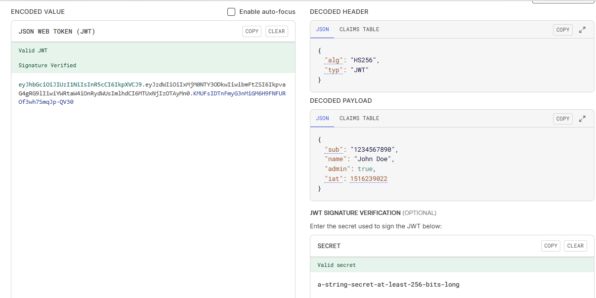
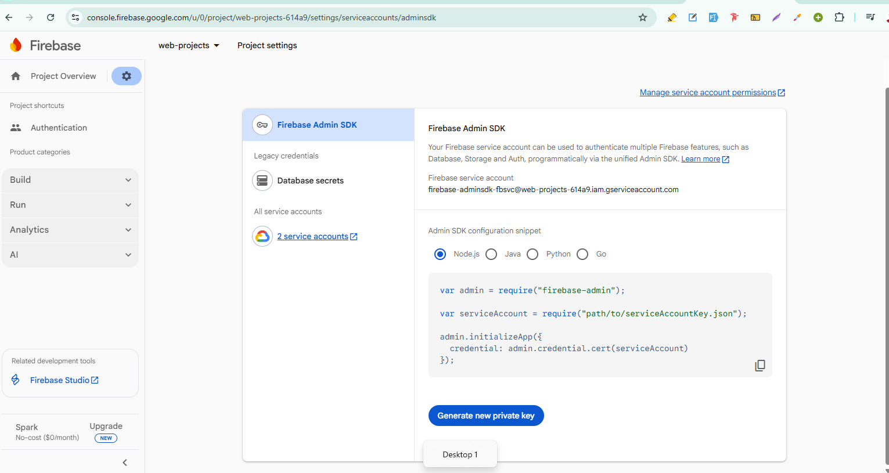

<h1 align="center">JWT Authorization+Authorization Notes</h1>

- [Introduction:](#introduction)
    - [JWT structure:](#jwt-structure)
- [firebase + JWT:](#firebase--jwt)
  - [JWT with LocalStorage:](#jwt-with-localstorage)
  - [JWT with Cookies:](#jwt-with-cookies)
    - [Without axios interceptor:](#without-axios-interceptor)
    - [With axios interceptor:](#with-axios-interceptor)
- [Firebase + Firebase Admin:](#firebase--firebase-admin)
  - [Without axios interceptor:](#without-axios-interceptor-1)
  - [With axios interceptor:](#with-axios-interceptor-1)
- [Custom Authentication + Authorization (JWT + Cookies):](#custom-authentication--authorization-jwt--cookies)


# Introduction: 
JWT stands for JSON Web Token. We use JWT to secure our API. It is a compact and secure way to transmit information between a client and a server as a JSON object.

After a user logs in successfully, the server generates a JWT and sends it to the client. The client then includes this token with every request to access protected routes (usually in the Authorization header).

The server verifies the token before allowing access to protected data. Without a valid token, a hacker or unauthorized user cannot access the API. Therefore, to access protected data, users must first log in through our system.

### JWT structure:

A JWT consists of three parts, separated by dots (.): header.payload.signature



# firebase + JWT:

## JWT with LocalStorage: 

- Frontend:

```js
// AuthProvider.jsx
import { auth } from "../firebase/firebase.init";
import { AuthContext } from "./AuthContext";
import { useEffect, useState } from "react";

import {
    GoogleAuthProvider,
    onAuthStateChanged,
    signInWithPopup,
    signOut,
} from "firebase/auth";

import axios from "axios";

export default function AuthProvider = ({ children }) => {
    const googleProvider = new GoogleAuthProvider();

    const [user, setUser] = useState(null);
    const [loading, setLoading] = useState(true);

    // Google Login
    const signInWithGoogle = () => {
        setLoading(true);
        return signInWithPopup(auth, googleProvider);
    };

    // Logout
    const logOut = () => {
        localStorage.removeItem("token");
        return signOut(auth);
    };

    useEffect(() => {
        const unsubscribe = onAuthStateChanged(
            auth,
            async (currentUser) => {
                setUser(currentUser);

                if (currentUser?.email) {
                    try {
                        // Get user from database
                        const res = await axios.get(`${import.meta.env.VITE_API_URL}/users/${currentUser.email}`);

                        const dbUser = res.data.result;

                        // JWT Payload
                        const payload = {
                            id: dbUser._id,
                            email: dbUser.email,
                            role: dbUser.role,
                        };

                        // Create JWT
                        const jwtRes = await axios.post( `${import.meta.env.VITE_API_URL}/jwt`,payload);

                        localStorage.setItem("token",jwtRes.data.token);

                    } catch (error) {
                        console.error(error);
                    }
                }

                setLoading(false);
            }
        );

        return () => unsubscribe();
    }, []);

    const authData = {
        user,
        setUser,
        logOut,
        signInWithGoogle,
        loading,
        setLoading,
    };

    return (
        <AuthContext value={authData}>
            {children}
        </AuthContext>
    );
};
```

```js
// AllUsers.jsx
import React, { useEffect, useState } from 'react'
import axios from 'axios'

const AllUsers = () => {
  const [users, setUsers] = useState([])

  useEffect(() => {
    axios.get(`${import.meta.env.VITE_API_URL}/users`, {
        headers: {
          Authorization: `Bearer ${localStorage.getItem('token')}`,
        },
      })
      .then((res) => setUsers(res.data))
      .catch((err) => console.log(err))
  }, [])

  return (
    <div className="p-5">
      <h2 className="text-xl font-bold mb-4">All Users</h2>

      <div className="overflow-x-auto">
        <table className="table">
          <thead>
            <tr>
              <th>ID</th>
              <th>Name</th>
              <th>Email</th>
              <th>Role</th>
            </tr>
          </thead>

          <tbody>
            {users.map((user) => (
              <tr key={user._id}>
                <td>{user._id}</td>
                <td>{user.name}</td>
                <td>{user.email}</td>
                <td>{user.role}</td>
              </tr>
            ))}
          </tbody>
        </table>
      </div>
    </div>
  )
}

export default AllUsers
```

- Backend: 

```bash
npm init -y
```

```bash
npm i express mongodb nodemon cors dotenv jsonwebtoken
```

```js
const express = require('express')
const cors = require('cors')
require('dotenv').config()
const { MongoClient, ServerApiVersion, ObjectId } = require('mongodb');
const jwt = require('jsonwebtoken')

const port = process.env.PORT || 3000

const app = express()
app.use(cors({
    origin: ['http://localhost:5173', 'add others frontend urls'],
    credentials: true
}))
app.use(express.json())


const client = new MongoClient(process.env.MONGODB_URI, {
    serverApi: {
        version: ServerApiVersion.v1,
        strict: true,
        deprecationErrors: true,
    }
});


// JWT Middlewares
const verifyJwt = (req, res, next) => {
    try {
        const token = req?.headers?.authorization?.split(' ')[1]

        if (!token) {
            return res.status(401).send({
                success: false,
                message: "Access token missing",
            });
        }

        const decoded = jwt.verify(token, config.JWT_ACCESS_SECRET)

        req.user = decoded;

        next();
    }
    catch {
        return res.status(401).send({
            success: false,
            message: "Authentication failed",
        });
    }
}

const verifyRole = (...roles) => {
    return (req, res, next) => {
        if (!req.user) {
            return res.status(401).send({
                success: false,
                message: "Authentication required",
            });
        }

        if (!roles.includes(req.user.role)) {
            return res.status(403).send({
                success: false,
                message: `Access denied. Required role: ${roles.join(', ')}`,
            });
        }

        next();
    };
};


async function run() {

    const productsCollection = client.db("ProductsDB").collection('products')
    const usersCollection = client.db("productsDB").collection('users')


    // Jwt API
    app.post("/jwt", async (req, res) => {
        const { id, email, role } = req.body
        const token = jwt.sign({ id, email, role }, process.env.JWT_ACCESS_SECRET, { expiresIn: '7d' })
        res.send({ token })
    })

    // products API
    app.post('/products', verifyJwt, verifyRole("SELLER", "ADMIN"), async (req, res) => {
        const product = req.body;
        const result = await productsCollection.insertOne(product);
        res.send(result);
    });

    app.get('/products', async (req, res) => {
        const products = await productsCollection.find({}).toArray();
        res.send(products);
    });

    app.get('/products/:id', verifyJwt, async (req, res) => {
        const id = req.params.id
        const filter = { _id: new ObjectId(id) }
        const result = await productsCollection.findOne(filter);
        res.send(result);
    });

    app.patch('/products/:id', verifyJwt, verifyRole("SELLER"), async (req, res) => {
        const id = req.params.id
        const filter = { _id: new ObjectId(id) }
        const updatedData = req.body;
        const updateDoc = {
            $set: {
                name: updatedData.name,
                description: updatedData.description
            }
        }

        const result = await productsCollection.updateOne(filter, updatedDoc);
        res.send(result);
    });

    app.delete('/products/:id', verifyJwt, verifyRole("SELLER", "ADMIN"), async (req, res) => {
        const result = await productsCollection.deleteOne({ _id: new ObjectId(req.params.id) });
        res.send(result);
    });


    // users API
    app.post('/users', async (req, res) => {
        const user = req.body;
        const result = await usersCollection.insertOne(user);
        res.send(result);
    });

    app.get('/users', verifyJwt, verifyRole("ADMIN"), async (req, res) => {
        const result = await usersCollection.find({}).toArray();
        res.send(result);
    });

    app.get('/users/:id', verifyJwt, verifyRole("USER", "ADMIN"), async (req, res) => {
        const id = req.params.id
        const filter = { _id: new ObjectId(id) }
        const result = await usersCollection.findOne(filter);
        res.send(result);
    });

    app.get('/users/:email', async (req, res) => {
        const email = req.query.email
        const result = await usersCollection.findOne({ email })
        res.send(result)
    })

    app.patch('/users/:id', verifyJwt, verifyRole("USER", "ADMIN"), async (req, res) => {
        const id = req.params.id
        const filter = { _id: new ObjectId(id) }
        const updatedData = req.body;
        const updateDoc = {
            $set: {
                name: updatedData.name,
                email: updatedData.email,
            }
        }

        const result = await usersCollection.updateOne(filter, updatedDoc);
        res.send(result);
    });

    app.delete('/users/:id', verifyJwt, verifyRole("ADMIN"), async (req, res) => {
        const result = await usersCollection.deleteOne({ _id: new ObjectId(req.params.id) });
        res.send(result);
    });

    await client.db("admin").command({ ping: 1 });
    console.log("Pinged your deployment. You successfully connected to MongoDB!");

}
run().catch(console.dir);


app.get('/', (req, res) => {
    res.send('Hello World!')
})

app.listen(port, () => {
    console.log(`Example app listening on port ${port}`)
})
```

```
# .env
MONGODB_URI=mongodb://localhost:27017/
PORT = 3000
JWT_ACCESS_SECRET=48c7ae40080b52a273cd579da2df72099b6d2d1648279ea03b56f2e4b58dcbdc1ca0e6cde63d6771b9f6b11de9e6ccfce1ec1eef7e7c74c8bc02d8bbc15d52f0
# require('crypto').randomBytes(64).toString('hex')
```

## JWT with Cookies: 

### Without axios interceptor: 

- Frontend:

```js
// AuthProvider.jsx
import { auth } from "../firebase/firebase.init";
import { AuthContext } from "./AuthContext";
import { useEffect, useState } from "react";
import { GoogleAuthProvider, onAuthStateChanged, signInWithPopup, signOut} from "firebase/auth";
import axios from "axios";

export default function AuthProvider = ({ children }) => {
    const googleProvider = new GoogleAuthProvider();

    const [user, setUser] = useState(null);
    const [loading, setLoading] = useState(true);

    // Google Login
    const signInWithGoogle = () => {
        setLoading(true);
        return signInWithPopup(auth, googleProvider);
    };

    // Logout
    const logOut = async () => {
        await axios.post(
            `${import.meta.env.VITE_API_URL}/jwt-logout`,{},{ withCredentials: true });

        return signOut(auth);
    };

    useEffect(() => {
        const unsubscribe = onAuthStateChanged(auth, async (currentUser) => {
            setUser(currentUser);

            // If user logged in
            if (currentUser?.email) {
                try {
                    // Get user from DB
                    const res = await axios.get(`${import.meta.env.VITE_API_URL}/users/${currentUser.email}`);

                    const dbUser = res.data.result;

                    // JWT Payload
                    const payload = {
                        id: dbUser._id,
                        email: dbUser.email,
                        role: dbUser.role,
                    };

                    // Create JWT Cookie
                    await axios.post(`${import.meta.env.VITE_API_URL}/jwt`,payload, { withCredentials: true });

                } catch (error) {
                    console.error(error);
                }
            }

            setLoading(false);
        });

        return () => unsubscribe();
    }, []);

    const authData = {
        user,
        setUser,
        loading,
        setLoading,
        signInWithGoogle,
        logOut,
    };

    return (
        <AuthContext value={authData}>
            {children}
        </AuthContext>
    );
};
```

```js
// AllUsers.jsx
import React, { useEffect, useState } from 'react'
import axios from 'axios'

const AllUsers = () => {
    const [users, setUsers] = useState([])

    useEffect(() => {
        axios.get(`${import.meta.env.VITE_API_URL}/users`, { withCredentials: true })
            .then((res) => setUsers(res.data))
            .catch((err) => console.log(err))
    }, [])

    return (
        <div className="p-5">
            <h2 className="text-xl font-bold mb-4">All Users</h2>

            <div className="overflow-x-auto">
                <table className="table">
                    <thead>
                        <tr>
                            <th>ID</th>
                            <th>Name</th>
                            <th>Email</th>
                            <th>Role</th>
                        </tr>
                    </thead>

                    <tbody>
                        {users.map((user) => (
                            <tr key={user._id}>
                                <td>{user._id}</td>
                                <td>{user.name}</td>
                                <td>{user.email}</td>
                                <td>{user.role}</td>
                            </tr>
                        ))}
                    </tbody>
                </table>
            </div>
        </div>
    )
}

export default AllUsers
```

- Backend:

```bash
npm init -y
```

```bash
npm i express mongodb nodemon cors dotenv jsonwebtoken cookie-parser
```

```js
const express = require('express')
const cors = require('cors')
require('dotenv').config()
const { MongoClient, ServerApiVersion, ObjectId } = require('mongodb');
const jwt = require('jsonwebtoken')
const cookieParser = require('cookie-parser')

const port = process.env.PORT || 3000

const app = express()
app.use(cors({
    origin: ['http://localhost:5173', 'add others frontend urls'],
    credentials: true
}))
app.use(express.json())
app.use(cookieParser())

const client = new MongoClient(process.env.MONGODB_URI, {
    serverApi: {
        version: ServerApiVersion.v1,
        strict: true,
        deprecationErrors: true,
    }
});


// JWT Middlewares
const verifyJwt = (req, res, next) => {
    try {
        const token = req?.cookies?.token

        if (!token) {
            return res.status(401).send({
                success: false,
                message: "Access token missing",
            });
        }

        const decoded = jwt.verify(token, config.JWT_ACCESS_SECRET)

        req.user = decoded;

        next();
    }
    catch {
        return res.status(401).send({
            success: false,
            message: "Authentication failed",
        });
    }
}

const verifyRole = (...roles) => {
    return (req, res, next) => {
        if (!req.user) {
            return res.status(401).send({
                success: false,
                message: "Authentication required",
            });
        }

        if (!roles.includes(req.user.role)) {
            return res.status(403).send({
                success: false,
                message: `Access denied. Required role: ${roles.join(', ')}`,
            });
        }

        next();
    };
};


async function run() {

    const productsCollection = client.db("ProductsDB").collection('products')
    const usersCollection = client.db("productsDB").collection('users')


    // Jwt API
    app.post("/jwt", async (req, res) => {
        const { id, email, role } = req.body
        const token = jwt.sign({ id, email, role }, process.env.JWT_ACCESS_SECRET, { expiresIn: '7d' })

        res.cookie('token', token, {
            httpOnly: true,
            secure: false,       // true in production 
            sameSite: "lax",     // "none" in production
        })

        res.send({
            success: true,
            message: "Authentication successful",
        })
    })

    app.post('/jwt-logout', (req, res) => {
        res.clearCookie('token', {
            httpOnly: true,
            secure: false,       // true in production 
            sameSite: "lax",     // "none" in production
        })
        res.send({
            success: true,
            message: "User logged out and token cleared",
        })

    })

    // products API
    app.post('/products', verifyJwt, verifyRole("SELLER", "ADMIN"), async (req, res) => {
        const product = req.body;
        const result = await productsCollection.insertOne(product);
        res.send(result);
    });

    app.get('/products', async (req, res) => {
        const products = await productsCollection.find({}).toArray();
        res.send(products);
    });

    app.get('/products/:id', verifyJwt, async (req, res) => {
        const id = req.params.id
        const filter = { _id: new ObjectId(id) }
        const result = await productsCollection.findOne(filter);
        res.send(result);
    });

    app.patch('/products/:id', verifyJwt, verifyRole("SELLER"), async (req, res) => {
        const id = req.params.id
        const filter = { _id: new ObjectId(id) }
        const updatedData = req.body;
        const updateDoc = {
            $set: {
                name: updatedData.name,
                description: updatedData.description
            }
        }

        const result = await productsCollection.updateOne(filter, updatedDoc);
        res.send(result);
    });

    app.delete('/products/:id', verifyJwt, verifyRole("SELLER", "ADMIN"), async (req, res) => {
        const result = await productsCollection.deleteOne({ _id: new ObjectId(req.params.id) });
        res.send(result);
    });


    // users API
    app.post('/users', async (req, res) => {
        const user = req.body;
        const result = await usersCollection.insertOne(user);
        res.send(result);
    });

    app.get('/users', verifyJwt, verifyRole("ADMIN"), async (req, res) => {
        const result = await usersCollection.find({}).toArray();
        res.send(result);
    });

    app.get('/users/:id', verifyJwt, verifyRole("USER", "ADMIN"), async (req, res) => {
        const id = req.params.id
        const filter = { _id: new ObjectId(id) }
        const result = await usersCollection.findOne(filter);
        res.send(result);
    });

    app.get('/users/:email', async (req, res) => {
        const email = req.query.email
        const result = await usersCollection.findOne({ email })
        res.send(result)
    })

    app.patch('/users/:id', verifyJwt, verifyRole("USER", "ADMIN"), async (req, res) => {
        const id = req.params.id
        const filter = { _id: new ObjectId(id) }
        const updatedData = req.body;
        const updateDoc = {
            $set: {
                name: updatedData.name,
                email: updatedData.email,
            }
        }

        const result = await usersCollection.updateOne(filter, updatedDoc);
        res.send(result);
    });

    app.delete('/users/:id', verifyJwt, verifyRole("ADMIN"), async (req, res) => {
        const result = await usersCollection.deleteOne({ _id: new ObjectId(req.params.id) });
        res.send(result);
    });

    await client.db("admin").command({ ping: 1 });
    console.log("Pinged your deployment. You successfully connected to MongoDB!");

}
run().catch(console.dir);


app.get('/', (req, res) => {
    res.send('Hello World!')
})

app.listen(port, () => {
    console.log(`Example app listening on port ${port}`)
})
```

```
# .env
MONGODB_URI=mongodb://localhost:27017/
PORT = 3000
JWT_ACCESS_SECRET=48c7ae40080b52a273cd579da2df72099b6d2d1648279ea03b56f2e4b58dcbdc1ca0e6cde63d6771b9f6b11de9e6ccfce1ec1eef7e7c74c8bc02d8bbc15d52f0
# require('crypto').randomBytes(64).toString('hex')
```

### With axios interceptor: 

- Frontend:

```js
// AuthProvider.jsx
import { auth } from "../firebase/firebase.init";
import { AuthContext } from "./AuthContext";
import { useEffect, useState } from "react";
import { GoogleAuthProvider, onAuthStateChanged, signInWithPopup, signOut} from "firebase/auth";
import axios from "axios";

export default function AuthProvider = ({ children }) => {
    const googleProvider = new GoogleAuthProvider();

    const [user, setUser] = useState(null);
    const [loading, setLoading] = useState(true);

    // Google Login
    const signInWithGoogle = () => {
        setLoading(true);
        return signInWithPopup(auth, googleProvider);
    };

    // Logout
    const logOut = async () => {
        await axios.post(
            `${import.meta.env.VITE_API_URL}/jwt-logout`,{},{ withCredentials: true });

        return signOut(auth);
    };

    useEffect(() => {
        const unsubscribe = onAuthStateChanged(auth, async (currentUser) => {
            setUser(currentUser);

            // If user logged in
            if (currentUser?.email) {
                try {
                    // Get user from DB
                    const res = await axios.get(`${import.meta.env.VITE_API_URL}/users/${currentUser.email}`);

                    const dbUser = res.data.result;

                    // JWT Payload
                    const payload = {
                        id: dbUser._id,
                        email: dbUser.email,
                        role: dbUser.role,
                    };

                    // Create JWT Cookie
                    await axios.post(`${import.meta.env.VITE_API_URL}/jwt`,payload, { withCredentials: true });

                } catch (error) {
                    console.error(error);
                }
            }

            setLoading(false);
        });

        return () => unsubscribe();
    }, []);

    const authData = {
        user,
        setUser,
        loading,
        setLoading,
        signInWithGoogle,
        logOut,
    };

    return (
        <AuthContext value={authData}>
            {children}
        </AuthContext>
    );
};
```

```js
// api/axiosSecure.js
import axios from 'axios'
import { signOut } from 'firebase/auth'
import { auth } from '../firebase/firebase.init'

const axiosSecure = axios.create({
    baseURL: import.meta.env.VITE_API_URL,
    withCredentials: true,
})

let isLoggingOut = false

axiosSecure.interceptors.response.use(
    (response) => response,
    async (error) => {
        const status = error.response?.status

        if (status === 401 && !isLoggingOut) {
            isLoggingOut = true

            try {
                // use plain axios to avoid interceptor loop
                await axios.post(
                    `${import.meta.env.VITE_API_URL}/jwt-logout`,
                    {},
                    { withCredentials: true }
                )

                await signOut(auth)
            } catch (err) {
                console.log(err)
            } finally {
                isLoggingOut = false
            }

            window.location.replace('/signin')
        }

        return Promise.reject(error)
    }
)

export default axiosSecure
```

```js
// Simple Version
import axios from 'axios'
import { signOut } from 'firebase/auth'
import { auth } from '../firebase/firebase.init'

const axiosSecure = axios.create({
    baseURL: import.meta.env.VITE_API_URL,
    withCredentials: true
})

axiosSecure.interceptors.response.use(
    response => response,
    error => {
        if (error.response?.status === 401 || error.response?.status === 403) {
            signOut(auth)
            window.location.href = '/signin'
        }
        return Promise.reject(error)
    }
)

export default axiosSecure
```

```js
// AllUsers.jsx
import React, { useEffect, useState } from 'react'
import axiosSecure from './api/axiosSecure'

const AllUsers = () => {
    const [users, setUsers] = useState([])

    useEffect(() => {
        axiosSecure.get(`${import.meta.env.VITE_API_URL}/users`, { withCredentials: true })
            .then((res) => setUsers(res.data))
            .catch((err) => console.log(err))
    }, [])

    return (
        <div className="p-5">
            <h2 className="text-xl font-bold mb-4">All Users</h2>

            <div className="overflow-x-auto">
                <table className="table">
                    <thead>
                        <tr>
                            <th>ID</th>
                            <th>Name</th>
                            <th>Email</th>
                            <th>Role</th>
                        </tr>
                    </thead>

                    <tbody>
                        {users.map((user) => (
                            <tr key={user._id}>
                                <td>{user._id}</td>
                                <td>{user.name}</td>
                                <td>{user.email}</td>
                                <td>{user.role}</td>
                            </tr>
                        ))}
                    </tbody>
                </table>
            </div>
        </div>
    )
}

export default AllUsers
```


- Backend:

```bash
npm init -y
```

```bash
npm i express mongodb nodemon cors dotenv jsonwebtoken cookie-parser
```

```js
const express = require('express')
const cors = require('cors')
require('dotenv').config()
const { MongoClient, ServerApiVersion, ObjectId } = require('mongodb');
const jwt = require('jsonwebtoken')
const cookieParser = require('cookie-parser')

const port = process.env.PORT || 3000

const app = express()
app.use(cors({
    origin: ['http://localhost:5173', 'add others frontend urls'],
    credentials: true
}))
app.use(express.json())
app.use(cookieParser())

const client = new MongoClient(process.env.MONGODB_URI, {
    serverApi: {
        version: ServerApiVersion.v1,
        strict: true,
        deprecationErrors: true,
    }
});


// JWT Middlewares
const verifyJwt = (req, res, next) => {
    try {
        const token = req?.cookies?.token

        if (!token) {
            return res.status(401).send({
                success: false,
                message: "Access token missing",
            });
        }

        const decoded = jwt.verify(token, config.JWT_ACCESS_SECRET)

        req.user = decoded;

        next();
    }
    catch {
        return res.status(401).send({
            success: false,
            message: "Authentication failed",
        });
    }
}

const verifyRole = (...roles) => {
    return (req, res, next) => {
        if (!req.user) {
            return res.status(401).send({
                success: false,
                message: "Authentication required",
            });
        }

        if (!roles.includes(req.user.role)) {
            return res.status(403).send({
                success: false,
                message: `Access denied. Required role: ${roles.join(', ')}`,
            });
        }

        next();
    };
};


async function run() {

    const productsCollection = client.db("ProductsDB").collection('products')
    const usersCollection = client.db("productsDB").collection('users')


    // Jwt API
    app.post("/jwt", async (req, res) => {
        const { id, email, role } = req.body
        const token = jwt.sign({ id, email, role }, process.env.JWT_ACCESS_SECRET, { expiresIn: '7d' })

        res.cookie('token', token, {
            httpOnly: true,
            secure: false,       // true in production 
            sameSite: "lax",     // "none" in production
        })

        res.send({
            success: true,
            message: "Authentication successful",
        })
    })

    app.post('/jwt-logout', (req, res) => {
        res.clearCookie('token', {
            httpOnly: true,
            secure: false,       // true in production 
            sameSite: "lax",     // "none" in production
        })
        res.send({
            success: true,
            message: "User logged out and token cleared",
        })

    })

    // products API
    app.post('/products', verifyJwt, verifyRole("SELLER", "ADMIN"), async (req, res) => {
        const product = req.body;
        const result = await productsCollection.insertOne(product);
        res.send(result);
    });

    app.get('/products', async (req, res) => {
        const products = await productsCollection.find({}).toArray();
        res.send(products);
    });

    app.get('/products/:id', verifyJwt, async (req, res) => {
        const id = req.params.id
        const filter = { _id: new ObjectId(id) }
        const result = await productsCollection.findOne(filter);
        res.send(result);
    });

    app.patch('/products/:id', verifyJwt, verifyRole("SELLER"), async (req, res) => {
        const id = req.params.id
        const filter = { _id: new ObjectId(id) }
        const updatedData = req.body;
        const updateDoc = {
            $set: {
                name: updatedData.name,
                description: updatedData.description
            }
        }

        const result = await productsCollection.updateOne(filter, updatedDoc);
        res.send(result);
    });

    app.delete('/products/:id', verifyJwt, verifyRole("SELLER", "ADMIN"), async (req, res) => {
        const result = await productsCollection.deleteOne({ _id: new ObjectId(req.params.id) });
        res.send(result);
    });


    // users API
    app.post('/users', async (req, res) => {
        const user = req.body;
        const result = await usersCollection.insertOne(user);
        res.send(result);
    });

    app.get('/users', verifyJwt, verifyRole("ADMIN"), async (req, res) => {
        const result = await usersCollection.find({}).toArray();
        res.send(result);
    });

    app.get('/users/:id', verifyJwt, verifyRole("USER", "ADMIN"), async (req, res) => {
        const id = req.params.id
        const filter = { _id: new ObjectId(id) }
        const result = await usersCollection.findOne(filter);
        res.send(result);
    });

    app.get('/users/:email', async (req, res) => {
        const email = req.query.email
        const result = await usersCollection.findOne({ email })
        res.send(result)
    })

    app.patch('/users/:id', verifyJwt, verifyRole("USER", "ADMIN"), async (req, res) => {
        const id = req.params.id
        const filter = { _id: new ObjectId(id) }
        const updatedData = req.body;
        const updateDoc = {
            $set: {
                name: updatedData.name,
                email: updatedData.email,
            }
        }

        const result = await usersCollection.updateOne(filter, updatedDoc);
        res.send(result);
    });

    app.delete('/users/:id', verifyJwt, verifyRole("ADMIN"), async (req, res) => {
        const result = await usersCollection.deleteOne({ _id: new ObjectId(req.params.id) });
        res.send(result);
    });

    await client.db("admin").command({ ping: 1 });
    console.log("Pinged your deployment. You successfully connected to MongoDB!");

}
run().catch(console.dir);


app.get('/', (req, res) => {
    res.send('Hello World!')
})

app.listen(port, () => {
    console.log(`Example app listening on port ${port}`)
})
```

```
# .env
MONGODB_URI=mongodb://localhost:27017/
PORT = 3000
JWT_ACCESS_SECRET=48c7ae40080b52a273cd579da2df72099b6d2d1648279ea03b56f2e4b58dcbdc1ca0e6cde63d6771b9f6b11de9e6ccfce1ec1eef7e7c74c8bc02d8bbc15d52f0
# require('crypto').randomBytes(64).toString('hex')
```

# Firebase + Firebase Admin:

**Note:** Instead of using JWT here we used firebase admin

## Without axios interceptor:

- Frontend: 

```js
// AuthProvider.jsx
import { auth } from '../firebase/firebase.init'
import { AuthContext } from './AuthContext'
import { useEffect, useState } from 'react'
import { GoogleAuthProvider, onAuthStateChanged, signInWithPopup, signOut, } from 'firebase/auth'

const AuthProvider = ({ children }) => {
  const googleProvider = new GoogleAuthProvider()

  const [user, setUser] = useState(null)
  const [loading, setLoading] = useState(true)

  const signInWithGoogle = () => {
    setLoading(true)
    return signInWithPopup(auth, googleProvider)
  }

  const logOut = () => {
    return signOut(auth)
  }

  useEffect(() => {
    const unsubscribe = onAuthStateChanged(auth, currentUser => {
      setUser(currentUser)
      setLoading(false)

    })
    return () => {
      unsubscribe()
    }
  }, [])

  const authData = {
    user,
    setUser,
    logOut,
    signInWithGoogle,
    loading,
    setLoading,
  }
  return <AuthContext value={authData}>{children}</AuthContext>
}

export default AuthProvider
```

```js
// AllUsers.jsx
import React, { useEffect, useState } from 'react'
import axios from 'axios';
import { AuthContext } from '../contexts/AuthContext';

const AllUsers = () => {
    const [users, setUsers] = useState([])
    const { user } = useContext(AuthContext)

    useEffect(() => {
        axios.get(`${import.meta.env.VITE_API_URL}/users`, {
            headers: {
                Authorization: `Bearer ${user?.accessToken}`
            }
        })
            .then((res) => setUsers(res.data))
            .catch((err) => console.log(err))
    }, [])

    return (
        <div className="p-5">
            <h2 className="text-xl font-bold mb-4">All Users</h2>

            <div className="overflow-x-auto">
                <table className="table">
                    <thead>
                        <tr>
                            <th>ID</th>
                            <th>Name</th>
                            <th>Email</th>
                            <th>Role</th>
                        </tr>
                    </thead>

                    <tbody>
                        {users.map((user) => (
                            <tr key={user._id}>
                                <td>{user._id}</td>
                                <td>{user.name}</td>
                                <td>{user.email}</td>
                                <td>{user.role}</td>
                            </tr>
                        ))}
                    </tbody>
                </table>
            </div>
        </div>
    )
}

export default AllUsers
```

- Backend: 

Step 1: 

```bash
npm i firebase-admin
```

Step 2: Go to firebase console: (Project Overview --> General --> Service Accounts) and generate private key



step 3: Convert the private key to base64 and store it into the env:

```js
MONGODB_URI = .....................
PORT = 3000
FB_SERVICE_KEY=...................................................................

# const fs = require('fs')
# const jsonData = fs.readFileSync('./serviceAccountKey.json')

# const base64String = Buffer.from(jsonData, 'utf-8').toString('base64')
# console.log(base64String)
```


step 4: 

```js
const express = require('express')
const cors = require('cors')
require('dotenv').config()
const { MongoClient, ServerApiVersion, ObjectId } = require('mongodb');
const admin = require("firebase-admin");

const decoded = Buffer.from(process.env.FB_SERVICE_KEY, 'base64').toString('utf-8')
const serviceAccount = JSON.parse(decoded);
admin.initializeApp({
    credential: admin.credential.cert(serviceAccount)
});

const port = process.env.PORT || 3000

const app = express()
app.use(cors({
    origin: ['http://localhost:5173', 'add others frontend urls'],
    credentials: true
}))
app.use(express.json())

const client = new MongoClient(process.env.MONGODB_URI, {
    serverApi: {
        version: ServerApiVersion.v1,
        strict: true,
        deprecationErrors: true,
    }
});


// firebase Middlewares
const verifyToken = (req, res, next) => {
    try {
        const token = req?.headers?.authorization?.split(' ')[1]

        if (!token) {
            return res.status(401).send({
                success: false,
                message: "Access token missing",
            });
        }

        const decoded = await admin.auth().verifyIdToken(token)
        // const decoded = await getAuth().verifyIdToken(token) // if use use const { getAuth } = require("firebase-admin/auth")

        req.user = decoded;

        next();
    }
    catch {
        return res.status(401).send({
            success: false,
            message: "Authentication failed",
        });
    }
}

const verifyRole = (...roles) => {
    return (req, res, next) => {
        if (!req.user) {
            return res.status(401).send({
                success: false,
                message: "Authentication required",
            });
        }

        if (!roles.includes(req.user.role)) {
            return res.status(403).send({
                success: false,
                message: `Access denied. Required role: ${roles.join(', ')}`,
            });
        }

        next();
    };
};


async function run() {

    const productsCollection = client.db("ProductsDB").collection('products')
    const usersCollection = client.db("productsDB").collection('users')

    // products API
    app.post('/products', verifyToken, verifyRole("SELLER", "ADMIN"), async (req, res) => {
        const product = req.body;
        const result = await productsCollection.insertOne(product);
        res.send(result);
    });

    app.get('/products', async (req, res) => {
        const products = await productsCollection.find({}).toArray();
        res.send(products);
    });

    app.get('/products/:id', verifyToken, async (req, res) => {
        const id = req.params.id
        const filter = { _id: new ObjectId(id) }
        const result = await productsCollection.findOne(filter);
        res.send(result);
    });

    app.patch('/products/:id', verifyToken, verifyRole("SELLER"), async (req, res) => {
        const id = req.params.id
        const filter = { _id: new ObjectId(id) }
        const updatedData = req.body;
        const updateDoc = {
            $set: {
                name: updatedData.name,
                description: updatedData.description
            }
        }

        const result = await productsCollection.updateOne(filter, updatedDoc);
        res.send(result);
    });

    app.delete('/products/:id', verifyToken, verifyRole("SELLER", "ADMIN"), async (req, res) => {
        const result = await productsCollection.deleteOne({ _id: new ObjectId(req.params.id) });
        res.send(result);
    });


    // users API
    app.post('/users', async (req, res) => {
        const user = req.body;
        const result = await usersCollection.insertOne(user);
        res.send(result);
    });

    app.get('/users', verifyToken, verifyRole("ADMIN"), async (req, res) => {
        const result = await usersCollection.find({}).toArray();
        res.send(result);
    });

    app.get('/users/:id', verifyToken, verifyRole("USER", "ADMIN"), async (req, res) => {
        const id = req.params.id
        const filter = { _id: new ObjectId(id) }
        const result = await usersCollection.findOne(filter);
        res.send(result);
    });

    app.get('/users/:email', async (req, res) => {
        const email = req.query.email
        const result = await usersCollection.findOne({ email })
        res.send(result)
    })

    app.patch('/users/:id', verifyToken, verifyRole("USER", "ADMIN"), async (req, res) => {
        const id = req.params.id
        const filter = { _id: new ObjectId(id) }
        const updatedData = req.body;
        const updateDoc = {
            $set: {
                name: updatedData.name,
                email: updatedData.email,
            }
        }

        const result = await usersCollection.updateOne(filter, updatedDoc);
        res.send(result);
    });

    app.delete('/users/:id', verifyToken, verifyRole("ADMIN"), async (req, res) => {
        const result = await usersCollection.deleteOne({ _id: new ObjectId(req.params.id) });
        res.send(result);
    });

    await client.db("admin").command({ ping: 1 });
    console.log("Pinged your deployment. You successfully connected to MongoDB!");

}
run().catch(console.dir);


app.get('/', (req, res) => {
    res.send('Hello World!')
})

app.listen(port, () => {
    console.log(`Example app listening on port ${port}`)
})
```

## With axios interceptor: 

```js
//api/axiosSecure.js
import axios from 'axios'
import { signOut } from 'firebase/auth'
import { auth } from '../firebase/firebase.init'

const axiosSecure = axios.create({
    baseURL: import.meta.env.VITE_API_URL
})

// ✅ REQUEST interceptor (attach Firebase token)
axiosSecure.interceptors.request.use(async (config) => {
    const user = auth.currentUser
    if (user) {
        const token = await user.getIdToken()
        config.headers.authorization = `Bearer ${token}`
    }
    return config
},
    error => Promise.reject(error)
)

// ✅ RESPONSE interceptor (auto logout)
axiosSecure.interceptors.response.use(response => response, error => {
    const status = error.response?.status
    if (status === 401 || status === 403) {
        signOut(auth)
        window.location.href = '/signin'
    }
    return Promise.reject(error)
}
)

export default axiosSecure
```

```js
// Better version
import axios from 'axios'
import { signOut } from 'firebase/auth'
import { auth } from '../firebase/firebase.init'

const axiosSecure = axios.create({
    baseURL: import.meta.env.VITE_API_URL,
})

let isLoggingOut = false

axiosSecure.interceptors.request.use(async (config) => {
    const user = auth.currentUser

    if (user) {
        const token = await user.getIdToken()
        config.headers.Authorization = `Bearer ${token}`
    }

    return config
})

axiosSecure.interceptors.response.use(
    (res) => res,
    async (error) => {
        const status = error.response?.status

        if ((status === 401 || status === 403) && !isLoggingOut) {
            isLoggingOut = true

            try {
                await signOut(auth)
            } finally {
                isLoggingOut = false
                window.location.replace('/signin')
            }
        }

        return Promise.reject(error)
    }
)
```

```jsx
// AllUsers.jsx
import React, { useEffect, useState } from 'react'
import axiosSecure from './api/axiosSecure';

const AllUsers = () => {
    const [users, setUsers] = useState([])

    useEffect(() => {
        axiosSecure.get(`${import.meta.env.VITE_API_URL}/users`)
            .then((res) => setUsers(res.data))
            .catch((err) => console.log(err))
    }, [])

    return (
        <div className="p-5">
            <h2 className="text-xl font-bold mb-4">All Users</h2>

            <div className="overflow-x-auto">
                <table className="table">
                    <thead>
                        <tr>
                            <th>ID</th>
                            <th>Name</th>
                            <th>Email</th>
                            <th>Role</th>
                        </tr>
                    </thead>

                    <tbody>
                        {users.map((user) => (
                            <tr key={user._id}>
                                <td>{user._id}</td>
                                <td>{user.name}</td>
                                <td>{user.email}</td>
                                <td>{user.role}</td>
                            </tr>
                        ))}
                    </tbody>
                </table>
            </div>
        </div>
    )
}

export default AllUsers
```

# Custom Authentication + Authorization (JWT + Cookies):

- setup: 
  
```bash
npm init -y
npm i express mongodb nodemon cors dotenv jsonwebtoken cookie-parser bcrypt
```

```js
// .env
MONGODB_URI=mongodb://localhost:27017/
PORT=3000
JWT_ACCESS_SECRET=your_jwt_secret_key
```

```json
// package.json
{
  "name": "jwt-auth",
  "version": "1.0.0",
  "description": "",
  "main": "index.js",
  "scripts": {
    "start": "node index.js",
    "dev": "nodemon index.js",
    "test": "echo \"Error: no test specified\" && exit 1"
  },
  "keywords": [],
  "author": "",
  "license": "ISC",
  "type": "commonjs",
  "dependencies": {
    "bcrypt": "^6.0.0",
    "cookie-parser": "^1.4.7",
    "cors": "^2.8.6",
    "dotenv": "^17.4.2",
    "express": "^5.2.1",
    "jsonwebtoken": "^9.0.3",
    "mongodb": "^7.2.0",
    "nodemon": "^3.1.14"
  }
}
```

- Sever: 

```js
// index.js

const express = require('express')
const cors = require('cors')
require('dotenv').config()

const { MongoClient, ServerApiVersion, ObjectId } = require('mongodb');
const jwt = require('jsonwebtoken')
const cookieParser = require('cookie-parser')
const bcrypt = require('bcrypt');

const port = process.env.PORT || 3000
const isProduction = process.env.NODE_ENV === "production";

const app = express()

app.use(cors({
    origin: ['http://localhost:5173', 'add other frontend urls'],
    credentials: true
}))

app.use(express.json())
app.use(cookieParser())

const client = new MongoClient(process.env.MONGODB_URI, {
    serverApi: {
        version: ServerApiVersion.v1,
        strict: true,
        deprecationErrors: true,
    }
});

async function run() {

    const productsCollection = client.db("testDB").collection('products')
    const usersCollection = client.db("testDB").collection('users')

    // Middlewares
    const verifyJwt = async (req, res, next) => {
        try {
            const token = req?.cookies?.token

            if (!token) {
                return res.status(401).send({
                    success: false,
                    message: "Access token missing",
                });
            }

            const decoded = jwt.verify(token, process.env.JWT_ACCESS_SECRET)

            const filter= { _id: new ObjectId(decoded.id) }
            const user = await usersCollection.findOne(filter, { projection: { password: 0 } })
            // in projection 0 means exclude that field from the result

            if (!user) {
                return res.status(401).send({
                    success: false,
                    message: "User not found",
                });
            }

            req.user = user

            next()

        }
        catch (error) {
            console.log(error)
            return res.status(401).send({
                success: false,
                message: "Authentication failed",
            });

        }
    }

    const verifyRole = (...roles) => {

        return (req, res, next) => {

            if (!req.user) {
                return res.status(401).send({
                    success: false,
                    message: "Authentication required",
                });
            }

            if (!roles.includes(req.user.role)) {
                return res.status(403).send({
                    success: false,
                    message: `Access denied. Required role: ${roles.join(', ')}`,
                });
            }

            next();
        };
    };


    // Auth API
    app.post('/auth/register', async (req, res) => {
        try {
            const { name, email, password } = req.body;

            const existingUser = await usersCollection.findOne({ email });

            if (existingUser) {
                return res.status(409).send({
                    success: false,
                    message: "User already exists",
                });
            }

            const hashedPassword = await bcrypt.hash(password, 10);

            const user = {
                name,
                email,
                image: "https://test-image.com",
                password: hashedPassword,
                role: "user",
            };

            await usersCollection.insertOne(user);

            return res.status(201).send({
                success: true,
                message: "User registered successfully",
                data: user
            });

        }
        catch (error) {
            console.log(error)
            return res.status(500).send({
                success: false,
                message: "Registration failed",
            });

        }

    });

    app.post('/auth/login', async (req, res) => {
        try {
            const { email, password } = req.body;

            const user = await usersCollection.findOne({ email });

            if (!user) {
                return res.status(401).send({
                    success: false,
                    message: "Invalid credentials",
                });
            }

            const isMatch = await bcrypt.compare(password, user.password);

            if (!isMatch) {
                return res.status(401).send({
                    success: false,
                    message: "Invalid credentials",
                });
            }

            const payload = { id: user._id }

            const token = jwt.sign(
                payload,
                process.env.JWT_ACCESS_SECRET,
                { expiresIn: '7d' }
            );

            res.cookie('token', token, {
                httpOnly: true,
                secure: isProduction,
                sameSite: isProduction ? "none" : "lax",
                maxAge: 7 * 24 * 60 * 60 * 1000
            });

            return res.status(200).send({
                success: true,
                message: "Login successful",
            });

        }
        catch (error) {
            console.log(error)
            return res.status(500).send({
                success: false,
                message: "Login failed",
            });

        }

    });

    app.post('/auth/logout', (req, res) => {
        try {
            res.clearCookie('token', {
                httpOnly: true,
                secure: isProduction,
                sameSite: isProduction ? "none" : "lax",
            });

            return res.status(200).send({
                success: true,
                message: "Logged out successfully"
            });
        }
        catch (error) {
            console.log(error)
            return res.status(500).send({
                success: false,
                message: "Logout failed",
            });
        }

    });

    app.get('/auth/me', verifyJwt, async (req, res) => {
        try {
            return res.status(200).send({
                success: true,
                message: "User fetched successfully",
                data: req.user
            });
        }
        catch (error) {
            console.log(error)
            return res.status(500).send({
                success: false,
                message: "Failed to fetch user",
            });

        }

    });

    // Users API
    app.get('/users', verifyJwt, verifyRole("admin"), async (req, res) => {
        try {
            const users = await usersCollection.find({}, { projection: { password: 0 } }).toArray();

            return res.status(200).send({
                success: true,
                message: "Users fetched successfully",
                data: users
            });
        }
        catch (error) {
            console.log(error)
            return res.status(500).send({
                success: false,
                message: "Failed to fetch users",
            });
        }
    });

    app.get('/users/id/:id', verifyJwt, verifyRole("admin"), async (req, res) => {
        try {
            const id = req.params.id;

            const user = await usersCollection.findOne({ _id: new ObjectId(id) }, { projection: { password: 0 } });

            if (!user) {
                return res.status(404).send({
                    success: false,
                    message: "User not found",
                });
            }

            return res.status(200).send({
                success: true,
                message: "User fetched successfully",
                data: user
            });

        }
        catch (error) {
            console.log(error)
            return res.status(500).send({
                success: false,
                message: "Failed to fetch user",
            });

        }
    });

    app.patch('/users/role/:id', verifyJwt, verifyRole("admin"), async (req, res) => {
        try {
            const id = req.params.id;
            const { role } = req.body;
            const filter = { _id: new ObjectId(id) };
            const updateDoc = {
                $set: {
                    role
                }
            };

            const result = await usersCollection.updateOne(filter, updateDoc);

            if (result.matchedCount === 0) {
                return res.status(404).send({
                    success: false,
                    message: "User not found",
                });
            }

            return res.status(200).send({
                success: true,
                message: "User role updated successfully",
            });

        }
        catch (error) {
            console.log(error)
            return res.status(500).send({
                success: false,
                message: "Failed to update role",
            });

        }

    });

    app.delete('/users/:id', verifyJwt, verifyRole("admin"), async (req, res) => {
        try {
            const id = req.params.id;
            const result = await usersCollection.deleteOne({ _id: new ObjectId(id) });

            if (result.deletedCount === 0) {
                return res.status(404).send({
                    success: false,
                    message: "User not found",
                });
            }

            return res.status(200).send({
                success: true,
                message: "User deleted successfully",
            });

        }
        catch (error) {
            console.log(error)
            return res.status(500).send({
                success: false,
                message: "Failed to delete user",
            });

        }

    });


    await client.db("admin").command({ ping: 1 });
    console.log("Pinged your deployment. You successfully connected to MongoDB!");

}
run().catch(console.dir);

app.get('/', (req, res) => {

    res.status(200).send({
        success: true,
        message: "Server is running",
    });

})

app.listen(port, () => {
    console.log(`Server listening on port ${port}`)
})
```